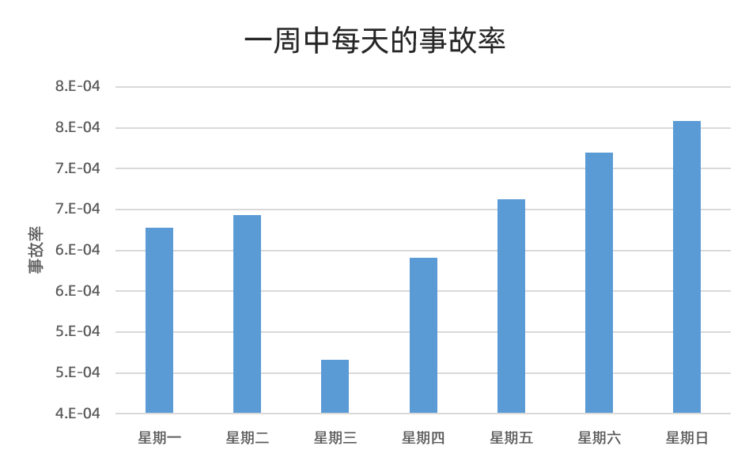
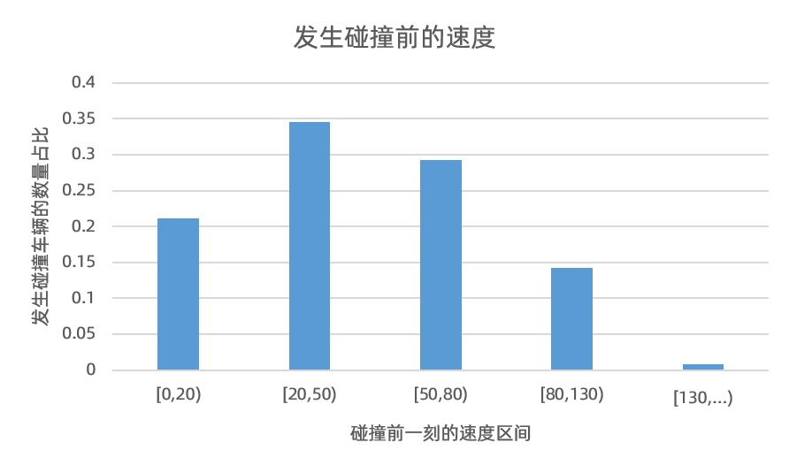

## Funciones de colisión

Las características de la colisión se analizan principalmente a partir del momento, lugar y velocidad de la colisión.

### Distribución temporal de las colisiones.

Como puede verse en la figura anterior, la probabilidad de accidentes los fines de semana es mayor que los días laborables.

Cada día se divide en cuatro períodos de tiempo, a saber: de 0:00 a 6:00, de 6:00 a 12:00, de 12:00 a 18:00 y de 18:00 a 24:00. El punto rojo es de 0 a 6 en punto, el amarillo oscuro es de 6 a 12 en punto, el amarillo es de 12 a 18 en punto y el verde es de 18 en punto a las 24 en punto.

Se puede ver en esta imagen que generalmente los puntos rojos están en el lado alto, los puntos verdes también están en el lado alto y los puntos amarillos oscuros están en su mayoría en el lado bajo. Esto muestra que la tasa de accidentes será mayor cuando se conduce de noche, pero la tasa de accidentes es ligeramente menor cuando se conduce por la mañana. Si la luz no es buena al conducir de noche, la tasa de accidentes naturalmente será mayor. Al conducir por la mañana, su estado mental es mejor y su conducción es más cautelosa, por lo que la tasa de accidentes será ligeramente menor.

### Distribución de lugares de colisión

La abscisa es la frecuencia de visitas del vehículo a la zona de colisión en ese mes. Como puede verse en la figura, el lugar de la colisión es un lugar que los vehículos no visitan con frecuencia. Esto demuestra que el conductor no está familiarizado con el tramo de la carretera en un lugar desconocido, lo que aumenta la probabilidad de accidentes.

### Distribución de velocidad cuando ocurre una colisión

El hardware pudo detectar la colisión porque se trataba de un accidente de tráfico importante debido al despliegue del airbag del vehículo. Sin embargo, como se puede ver en la figura anterior, la velocidad del vehículo antes de la colisión está en el intervalo [20, 50] con la mayoría de los vehículos, seguido por el intervalo de velocidad [50, 80], y hay muchos vehículos con la velocidad [0, 20]. Muestra que algunos vehículos chocaron a baja velocidad, por lo que lo más probable es que fueran atropellados por otros vehículos. Ésta es también la mayor dificultad de este proyecto.
