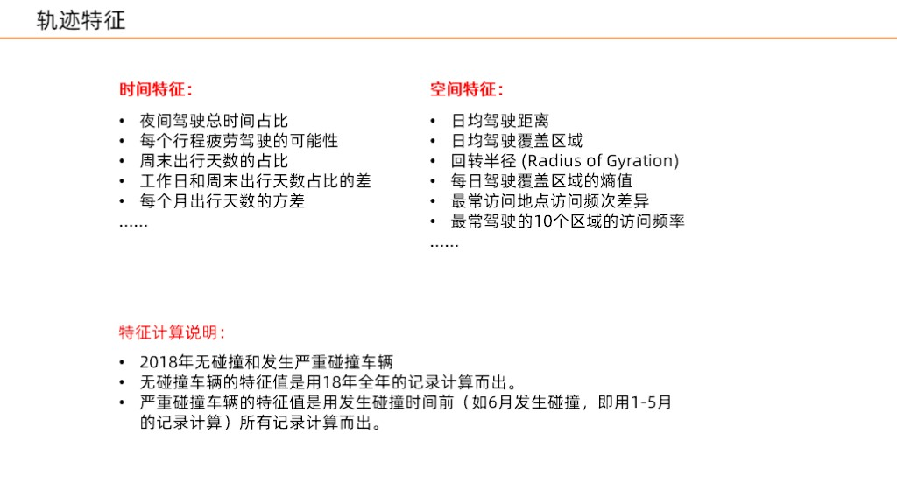
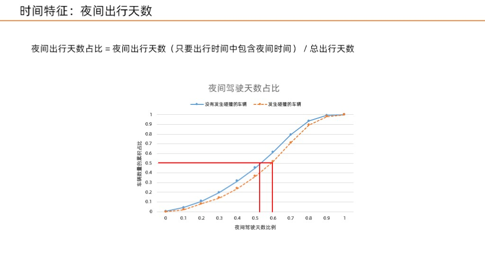
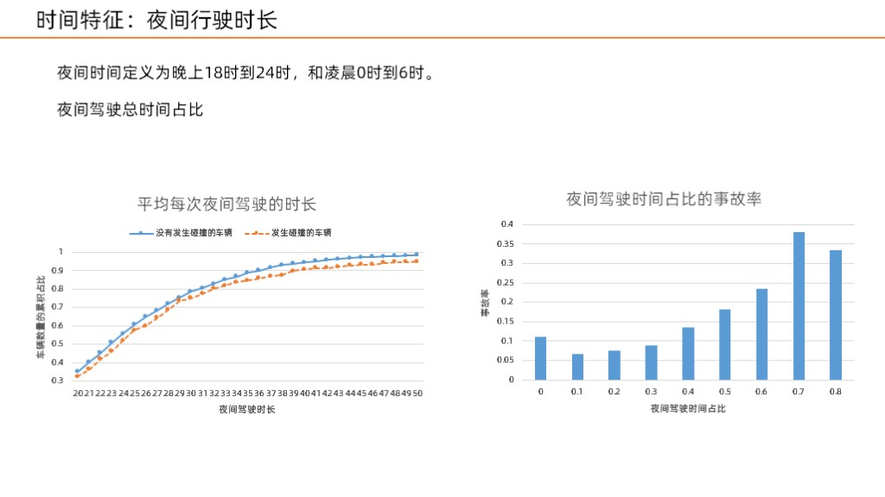
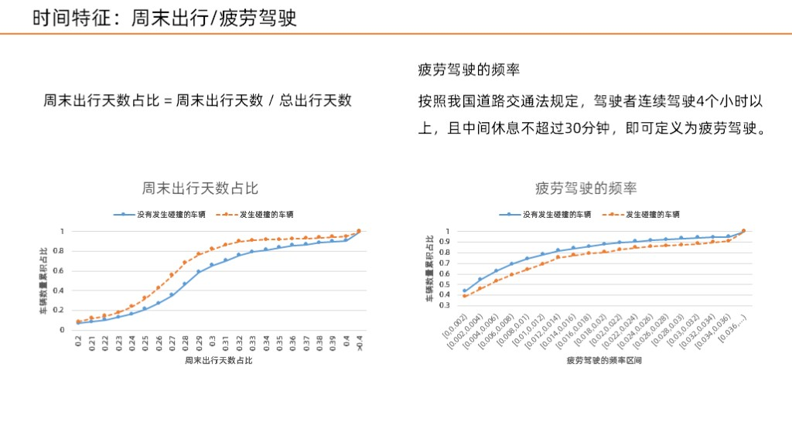

Al clasificar la literatura e identificar las características de colisión, las características que extraje se dividen principalmente en dos partes, una es la característica temporal y la otra es la característica espacial.

