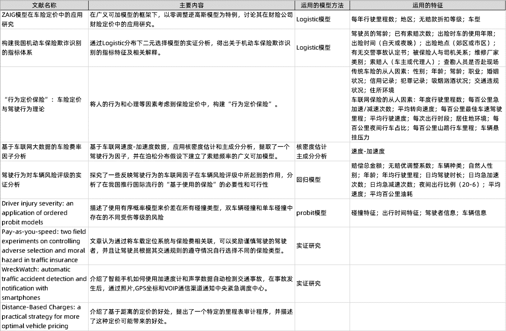

Los datos proceden de una gran empresa automovilística nacional. Los datos de posición del vehículo (en lo sucesivo denominados datos de trayectoria) y los datos de aceleración de velocidad registrados por el registrador del vehículo se utilizan para describir los hábitos de conducción del conductor y determinar así la posibilidad de una colisión con el vehículo.

### Importancia del proyecto

No sólo permite a los conductores comprender sus hábitos de conducción, sino que también desempeña un papel de vigilancia.

Más importante aún, se puede aplicar a escenarios de fijación de precios de seguros de automóviles.

### Introducción a la tabla de datos

Rango de tiempo de datos: 2018.01-2019.04

|Nombre de la tabla de datos|Volumen total de datos|Número de vehículos relacionados|Descripción de la tabla de datos|
|--------|-------|-----------|----------|
|Tabla de información básica del vehículo|Aproximadamente 15.000 elementos|Sin colisión: 4000; Colisión mayor: 717; Colisión menor: 11107|Contiene el tiempo de compra del vehículo, el tiempo de mantenimiento de la parada en boxes del vehículo, información básica del comprador del vehículo y si se produjo una colisión|
|Tabla de datos de trayectoria del vehículo|Aproximadamente 300 millones|Sin colisión: 3885 Colisión mayor: 685 Colisión menor: 10676|Contiene datos de trayectoria del vehículo, recopilados una vez por minuto|
|Tabla de datos de velocidad y aceleración del vehículo|Aproximadamente 110 millones|Sin colisión: 3576; Colisión mayor: 535; Colisión menor: 10642|Contiene datos de velocidad y aceleración del vehículo, los datos solo se recopilarán si la aceleración es >1,39 m/s2|

### revisión de literatura

Después de resumir algunos factores de fijación de precios de seguros de automóviles nacionales y extranjeros, encontramos que la mayoría de las características utilizadas en la literatura se centran en el contenido de la aceleración de la velocidad y el contenido de la información básica del vehículo, mientras que las características del contenido de la información de la posición de conducción del vehículo no se han centrado en sido tenido en cuenta. Luego resumimos las características de la ingeniería de características que queremos construir.

### Dificultades del proyecto

1. Las colisiones son muy aleatorias y no está claro si el conductor fue atropellado por otro vehículo o si él mismo chocó contra otro vehículo. También se ve afectado por el clima, las condiciones de la carretera, el estado del conductor en ese momento y factores inciertos, etc.

2. Las funciones básicas del controlador son difíciles de utilizar. Dado que las características básicas del conductor son las registradas cuando se compró el vehículo, es muy probable que el vehículo fuera conducido por otra persona, o que alguien más estuviera conduciendo el vehículo en el momento de la colisión.

3. La cantidad de datos es grande y es difícil procesarlos todos a la vez. La cantidad de datos es relativamente grande y es necesario procesarlos en lotes.

4. Dado que los datos se transmiten al servidor a través de señales 4g, pueden ocurrir interrupciones en la señal, fallas en la carga de datos, etc. En este momento, cómo preprocesar los datos también es un paso muy importante.

5. Los datos de velocidad y aceleración se recopilan solo después de que la aceleración alcanza un cierto umbral, por lo que para los vehículos que viajan a una velocidad constante, no hay registro de velocidad y aceleración. Por el contrario, para algunos vehículos que suelen frenar y acelerar repentinamente, habrá más récords de velocidad y aceleración.

6. A través de la distribución del volumen de datos, encontramos que algunos días, debido a actualizaciones de equipos, solo una cantidad muy pequeña de vehículos tendrá registros ese día. Habrá algunas diferencias en la cantidad de datos.

### Resumen de factores característicos

Los factores característicos se dividen en tres categorías, a saber: características básicas del vehículo, características básicas del conductor, características del comportamiento de conducción y otras características.

1. Características básicas del vehículo: antigüedad, si hay pasajeros al volante, modelo y kilometraje acumulado de conducción.

2. Características básicas del conductor: género, edad, alcoholismo, tendencias violentas, tipo de licencia de conducir, experiencia de conducción, ocupación.

3. Características del comportamiento de conducción: características de movimiento (incluidas características de tiempo, características espaciales), características de aceleración de velocidad y características de colisión.

4. Otras características: clima, condiciones de la carretera, etc.

